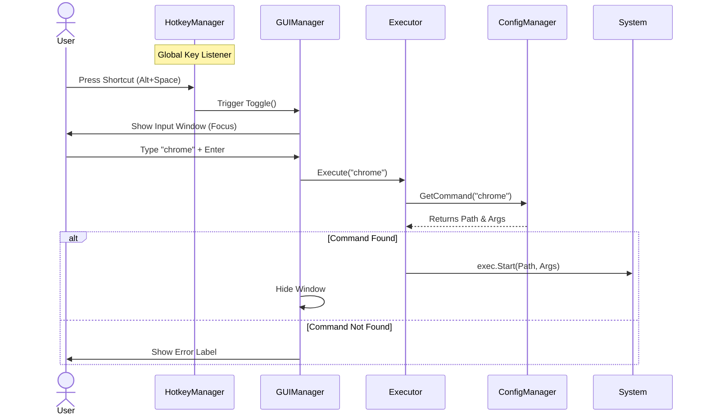

# Design Document

## Overview

The application launcher is a lightweight, keyboard-driven utility that provides quick access to frequently used applications through a simple command interface. Built with Golang, Fyne for GUI, and a keyboard shortcut library, the launcher displays a text input window when activated via hotkey, executes commands mapped to applications via a JSON configuration file, and hides itself after launching the target application.

The system follows a simple architecture with three main components: a hotkey listener that activates the UI, a Fyne-based GUI that captures user input, and a command executor that reads the JSON configuration and launches applications.

## Architecture

The launcher follows a modular architecture with clear separation of concerns:

```
┌─────────────────────────────────────────────────┐
│              Main Application                    │
│  - Initialization                                │
│  - Lifecycle Management                          │
└───────┬─────────────────────────────────────────┘
        │
        ├──────────────────┬──────────────────┬────────────────
        │                  │                  │
┌───────▼────────┐ ┌───────▼────────┐ ┌──────▼──────────┐
│ Hotkey Manager │ │  GUI Manager   │ │ Config Manager  │
│                │ │                │ │                 │
│ - Register     │ │ - Show/Hide    │ │ - Load Config   │
│   hotkey       │ │   window       │ │ - Parse JSON    │
│ - Listen for   │ │ - Handle input │ │ - Validate      │
│   activation   │ │ - Display      │ │                 │
│                │ │   errors       │ │                 │
└────────────────┘ └───────┬────────┘ └─────────────────┘
                           │
                   ┌───────▼────────┐
                   │   Executor     │
                   │                │
                   │ - Lookup cmd   │
                   │ - Launch app   │
                   │ - Handle errors│
                   └────────────────┘
```

### Component Interaction Flow

1. **Startup**: Main application initializes Config Manager, loads configuration, registers hotkey with Hotkey Manager, and initializes GUI Manager
2. **Activation**: User presses hotkey → Hotkey Manager notifies GUI Manager → GUI Manager displays text box
3. **Command Execution**: User enters command and presses Enter → GUI Manager passes command to Executor → Executor looks up command in Config Manager → Executor launches application → GUI Manager hides window
4. **Cancellation**: User presses Escape → GUI Manager hides window



## Components and Interfaces

### 1. Main Application

**Responsibilities:**
- Initialize all components
- Coordinate component lifecycle
- Handle graceful shutdown

**Interface:**
```go
type App struct {
    config   *ConfigManager
    hotkey   *HotkeyManager
    gui      *GUIManager
    executor *Executor
}

func NewApp() (*App, error)
func (a *App) Run() error
func (a *App) Shutdown()
```

### 2. Config Manager

**Responsibilities:**
- Load and parse JSON configuration file
- Validate configuration structure
- Provide command lookup functionality

**Interface:**
```go
type ConfigManager struct {
    configPath string
    commands   map[string]Command
}

type Command struct {
    Path string   `json:"path"`
    Args []string `json:"args"`
}

func NewConfigManager(configPath string) (*ConfigManager, error)
func (c *ConfigManager) Load() error
func (c *ConfigManager) GetCommand(name string) (Command, bool)
```

**Configuration File Format:**
```json
{
  "commands": {
    "browser": {
      "path": "C:\\Program Files\\Mozilla Firefox\\firefox.exe",
      "args": []
    },
    "editor": {
      "path": "C:\\Program Files\\Microsoft VS Code\\Code.exe",
      "args": ["-n"]
    },
    "terminal": {
      "path": "C:\\Windows\\System32\\cmd.exe",
      "args": []
    }
  }
}
```

### 3. Hotkey Manager

**Responsibilities:**
- Register global keyboard shortcut
- Listen for hotkey activation
- Notify GUI Manager when hotkey is pressed

**Interface:**
```go
type HotkeyManager struct {
    callback func()
}

func NewHotkeyManager(callback func()) (*HotkeyManager, error)
func (h *HotkeyManager) Register(hotkey string) error
func (h *HotkeyManager) Start() error
func (h *HotkeyManager) Stop()
```

### 4. GUI Manager

**Responsibilities:**
- Create and manage Fyne window
- Show/hide text input interface
- Handle user input (Enter, Escape)
- Display error messages
- Coordinate with Executor for command execution

**Interface:**
```go
type GUIManager struct {
    app      fyne.App
    window   fyne.Window
    entry    *widget.Entry
    executor *Executor
    visible  bool
}

func NewGUIManager(executor *Executor) *GUIManager
func (g *GUIManager) Initialize()
func (g *GUIManager) Toggle()
func (g *GUIManager) Show()
func (g *GUIManager) Hide()
func (g *GUIManager) ShowError(message string)
```

### 5. Executor

**Responsibilities:**
- Look up commands in configuration
- Launch applications with specified arguments
- Handle execution errors
- Run applications without blocking
- Normalize file paths (convert forward slashes `/` to backslashes `\` on Windows)

**Interface:**
```go
type Executor struct {
    config *ConfigManager
}

func NewExecutor(config *ConfigManager) *Executor
func (e *Executor) Execute(commandName string) error
```

## Data Models

### Command Configuration

The primary data structure is the command mapping stored in JSON:

```go
type Config struct {
    Commands map[string]Command `json:"commands"`
}

type Command struct {
    Path string   `json:"path"`  // Absolute or relative path to executable
    Args []string `json:"args"`  // Command-line arguments
}
```

**Validation Rules:**
- Command names must be non-empty strings
- Path must be a non-empty string (forward slashes allowed, converted internally)
- Args can be empty array but must be present
- Duplicate command names are not allowed (map structure enforces this)

### Runtime State

```go
type AppState struct {
    ConfigLoaded bool
    WindowVisible bool
    LastError error
}
```

## 
Correctness Properties

*A property is a characteristic or behavior that should hold true across all valid executions of a system-essentially, a formal statement about what the system should do. Properties serve as the bridge between human-readable specifications and machine-verifiable correctness guarantees.*

### Property 1: Hotkey toggles window visibility

*For any* window visibility state, pressing the configured hotkey should toggle the window to the opposite visibility state (hidden → visible, visible → hidden).

**Validates: Requirements 1.1, 1.3**

### Property 2: Window show focuses input field

*For any* window show event, the input field should receive focus immediately after the window becomes visible.

**Validates: Requirements 1.2**

### Property 3: Valid commands execute correctly

*For any* valid command name in the configuration, entering that command and pressing Enter should execute the application with the exact path and arguments specified in the configuration file.

**Validates: Requirements 2.1, 2.2, 5.1, 5.2**

### Property 4: Successful launch hides window

*For any* command that successfully launches an application, the window should become hidden immediately after execution.

**Validates: Requirements 2.3**

### Property 5: Invalid commands show errors

*For any* command name that does not exist in the configuration, entering that command and pressing Enter should display an error message and keep the window visible.

**Validates: Requirements 2.4**

### Property 6: Escape cancels without execution

*For any* text entered in the input field, pressing Escape should hide the window without executing any command or launching any application.

**Validates: Requirements 2.5**

### Property 7: Valid JSON configurations load completely

*For any* valid JSON configuration file with proper structure, loading the configuration should successfully parse all command mappings and make them available for lookup.

**Validates: Requirements 3.2**

### Property 8: Invalid configurations fail gracefully

*For any* missing or malformed configuration file, the launcher should display a clear error message and exit without crashing.

**Validates: Requirements 3.3**

### Property 9: Launch failures show error details

*For any* command that fails to launch (invalid path, permission denied, etc.), the launcher should display an error message containing details about the failure.

**Validates: Requirements 5.3**

### Property 10: Application launch is non-blocking

*For any* application launched by the executor, the launch function should return control immediately without waiting for the application to complete execution.

**Validates: Requirements 5.4**

## Error Handling

The launcher implements comprehensive error handling at multiple levels:

### Configuration Errors

**File Not Found:**
- Display error dialog: "Configuration file not found at [path]"
- Exit application with error code 1

**Invalid JSON:**
- Display error dialog: "Invalid configuration file: [parse error details]"
- Exit application with error code 1

**Invalid Structure:**
- Display error dialog: "Configuration file has invalid structure: [validation error]"
- Exit application with error code 1

### Execution Errors

**Command Not Found:**
- Display error message in GUI: "Command '[name]' not found"
- Keep window visible for user to retry
- Log error to stderr

**Application Launch Failure:**
- Display error message in GUI: "Failed to launch '[command]': [error details]"
- Keep window visible for user to retry
- Log error to stderr with full details

**Permission Denied:**
- Display error message in GUI: "Permission denied: Cannot execute '[path]'"
- Keep window visible for user to retry
- Log error to stderr

### Hotkey Registration Errors

**Hotkey Already in Use:**
- Display error dialog: "Cannot register hotkey [key]: already in use by another application"
- Exit application with error code 1

**Invalid Hotkey Format:**
- Display error dialog: "Invalid hotkey format: [key]"
- Exit application with error code 1

### GUI Errors

**Window Creation Failure:**
- Log error to stderr: "Failed to create GUI window: [error]"
- Exit application with error code 1

All errors are logged to stderr with timestamps and full context for debugging purposes.

## Testing Strategy

The launcher will be tested using a dual approach combining unit tests for specific behaviors and property-based tests for universal properties.

### Unit Testing

Unit tests will verify specific examples and integration points:

**Configuration Loading:**
- Test loading a valid configuration file with multiple commands
- Test handling of missing configuration file
- Test handling of malformed JSON
- Test handling of empty configuration

**Command Execution:**
- Test executing a simple command without arguments
- Test executing a command with multiple arguments
- Test handling of non-existent executable path
- Test handling of permission denied errors

**GUI Interactions:**
- Test window show/hide on hotkey press
- Test Escape key cancellation
- Test Enter key command submission
- Test error message display

### Property-Based Testing

Property-based tests will verify universal properties across many randomly generated inputs using the **gopter** library for Go. Each property test will run a minimum of 100 iterations.

**Configuration Properties:**
- Property 7: Generate random valid JSON configurations and verify complete loading
- Property 8: Generate random invalid configurations (malformed JSON, missing files) and verify graceful failure

**Execution Properties:**
- Property 3: Generate random valid commands and verify correct execution with path and arguments
- Property 5: Generate random invalid command names and verify error display
- Property 9: Generate random invalid executable paths and verify error handling
- Property 10: Generate random commands and verify non-blocking execution

**UI Properties:**
- Property 1: Test hotkey toggle across random visibility states
- Property 2: Test input focus across random window show events
- Property 4: Test window hiding across random successful launches
- Property 6: Test Escape cancellation across random input states

Each property-based test will be tagged with a comment explicitly referencing the correctness property from this design document using the format: **Feature: app-launcher, Property {number}: {property_text}**

### Test Organization

```
launcher/
├── main.go
├── config/
│   ├── config.go
│   └── config_test.go
├── executor/
│   ├── executor.go
│   └── executor_test.go
├── gui/
│   ├── gui.go
│   └── gui_test.go
├── hotkey/
│   ├── hotkey.go
│   └── hotkey_test.go
└── testdata/
    ├── valid_config.json
    ├── invalid_config.json
    └── empty_config.json
```

### Testing Tools

- **Standard library testing package**: For unit tests
- **gopter**: For property-based testing
- **testify/assert**: For test assertions
- **testify/mock**: For mocking external dependencies where necessary

### Continuous Testing

- All tests must pass before merging code
- Property-based tests run with minimum 100 iterations
- Integration tests verify end-to-end workflows
- Manual testing on Windows

## Implementation Notes

### Platform Considerations

This launcher is designed specifically for Windows:
- Use backslashes in config paths
- Handle Windows-specific executable extensions (.exe)
- Test with Windows-style paths (C:\Program Files\...)
- Use Windows-specific APIs for process launching

### Configuration File Location

Default configuration file location:
- `%APPDATA%\launcher\config.json`

Allow override via command-line flag: `--config=C:\path\to\config.json`

### Hotkey Configuration

Default hotkey: `Alt+Space`

Allow configuration via command-line flag: `--hotkey="Ctrl+Alt+L"`

### Performance Considerations

- Configuration file should be loaded once at startup (no hot-reload)
- Command lookup should use map for O(1) access
- GUI should remain responsive during application launch
- Application launch should be asynchronous to prevent blocking

### Security Considerations

- Validate all paths from configuration to prevent path traversal
- Do not execute commands with shell interpretation (use direct exec)
- Log all execution attempts for audit purposes
- Warn users about executing untrusted configurations

## Future Enhancements (Out of Scope)

The following features are explicitly out of scope for the initial implementation but may be considered for future versions:

- Configuration hot-reload without restart
- Built-in configuration editor GUI
- Command history and autocomplete
- Command aliases and shortcuts
- Environment variable substitution in commands
- Working directory specification per command
- Visual feedback for running applications
- Command output capture and display
